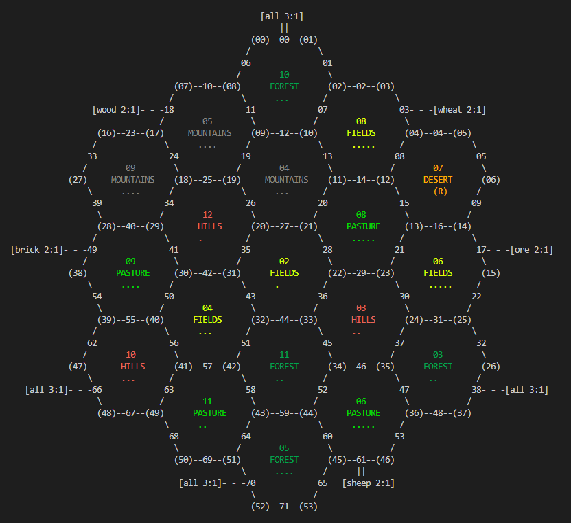

# HexBot

  <a href="https://github.com/AidanInceer/HexBot">
    
  </a>
  <a href="https://opensource.org/licenses/MIT">
    
  </a>
  <a href="https://github.com/psf/black">
    
  </a>
  <a href="#badge">
    
  </a>
  <a href="https://github.com/AidanInceer/HexBot/actions/workflows/build.yml">
    
  </a>
  <a href="https://github.com/AidanInceer/HexBot/actions/workflows/lint.yml">
    
  </a>
    <a href="https://github.com/AidanInceer/HexBot/actions/workflows/test.yml">
    
  </a>
  <a href="https://github.com/AidanInceer/HexBot/actions/workflows/scan.yml">
    
  </a>
  <a href="https://sonarcloud.io/summary/new_code?id=AidanInceer_HexBot">
    
  </a>
  <a href="https://sonarcloud.io/summary/new_code?id=AidanInceer_HexBot">
    
  </a>
  <a href="https://sonarcloud.io/summary/new_code?id=AidanInceer_HexBot">
    
  </a>
  <a href="https://sonarcloud.io/summary/new_code?id=AidanInceer_HexBot">
    
  </a>
<a href="https://sonarcloud.io/summary/new_code?id=AidanInceer_HexBot">
    
  </a>
<a href="https://sonarcloud.io/summary/new_code?id=AidanInceer_HexBot">
    
  </a>

## Introduction

Currently the board/game is displayed in the command line. However in future i would like to move this either to a website of full built out UI.



### Task list

- [ ] Productionize
- [ ] Basic bot functionality
- [ ] Input validation
- [ ] Neural net implementation
- [ ] Training
- [ ] UI/Web Development

## Setup

To get started with HexBot, follow these steps:

- Clone the repository:

  ```bash
  git clone https://github.com/AidanInceer/HexBot
  ```

- Install the required dependencies:

  ```bash
  pip install -r requirements.txt
  ```

- Run the application:

  ```bash
  python main.py
  ```

## Additional Configuration

You can adjust the game settings in the central configuration file `src/catan/config/config.py`. This can be used to adjust the number of players, automatic setup, bot strength and much more.
